# Task Manager App

## Overview
This Task Manager App is designed to provide a **responsive** and **adaptive** experience across mobile platforms (iOS and Android) and desktop environments. The UI adjusts based on the screen size, ensuring smooth functionality across different device types.

### Features
- **Responsive Design**: Adjusts to different screen sizes.
- **Adaptive UI**: Tailored experience for mobile and desktop.
- **Cross-platform**: Supports Android, iOS, and Desktop.
- **GetX State Management**: Efficient and reactive state management.

## Device Testing
The app has been thoroughly tested on various devices to ensure it works optimally across different screen sizes and platforms.

### Desktop
- **Desktop View**: The app layout adapts for larger screens like desktops, providing a tailored experience.

### Desktop Screenshots
<p float="left">
  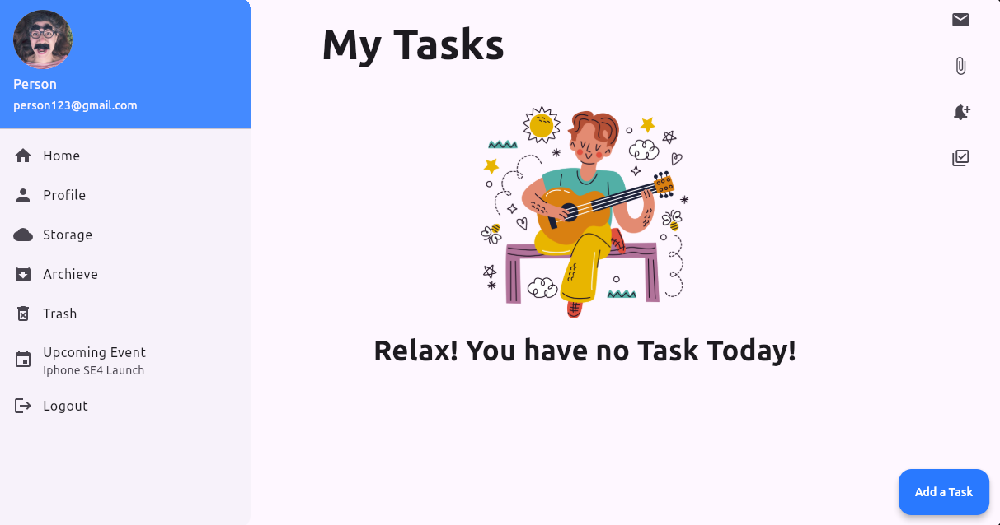
</p>
<p float="left">
  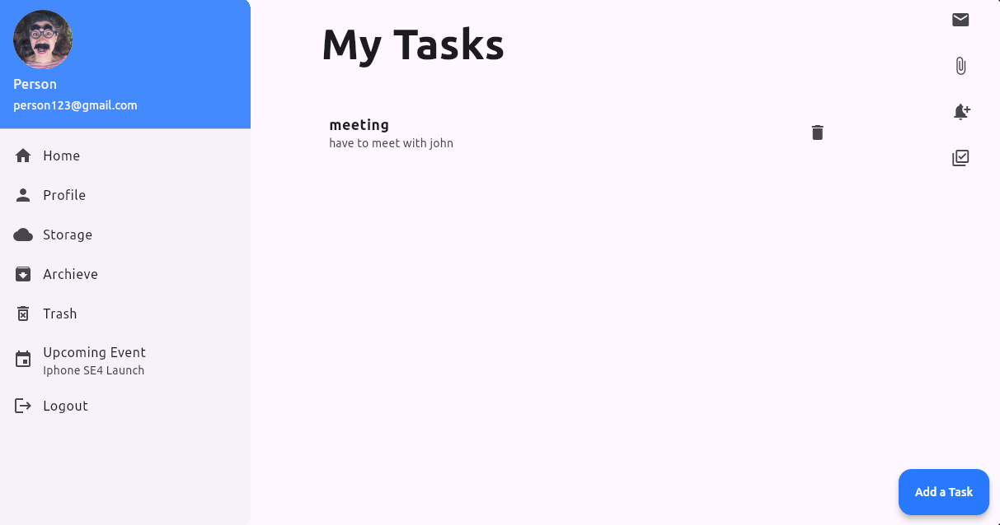
</p>

### iOS Devices
- **iPhone SE (Smaller iPhone)**: Screenshots show the app on smaller iPhone devices.
- **iPhone 13 (Larger iPhone)**: Screenshots show the app on larger iPhone devices.

### Android Devices
- **Smaller Android Devices**: Tested on devices like Pixel 4, Moto G.
- **Larger Android Devices**: Tested on devices like Samsung Galaxy S21.

## Screenshots

### Smaller iPhone (iPhone SE)
<p float="left">
  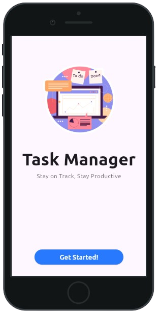
  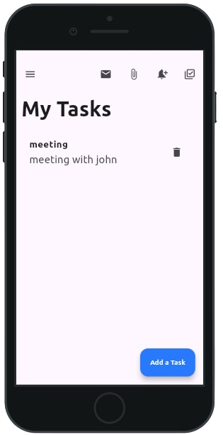
  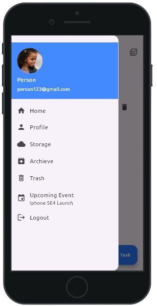
</p>

### Larger iPhone (iPhone 13)
<p float="left">
  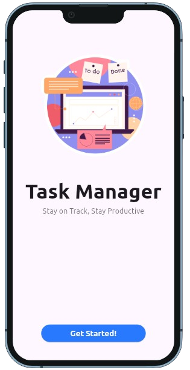
  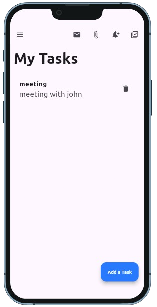
  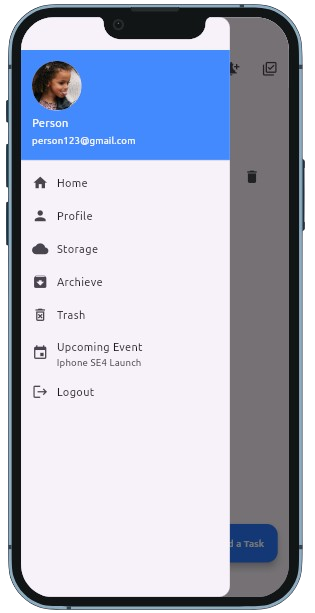
</p>

### Smaller Android
<p float="left">
  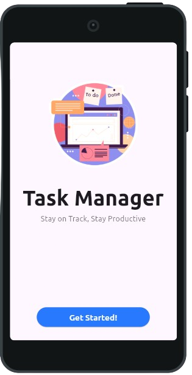
  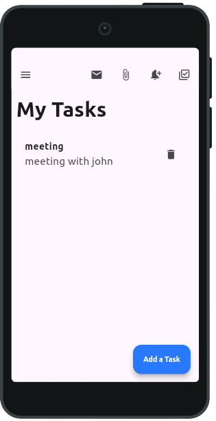
  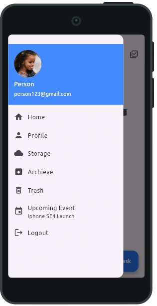
</p>

### Larger Android (Samsung Galaxy)
<p float="left">
  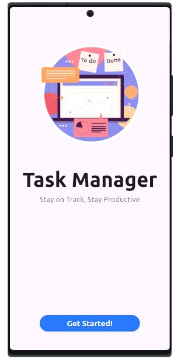
  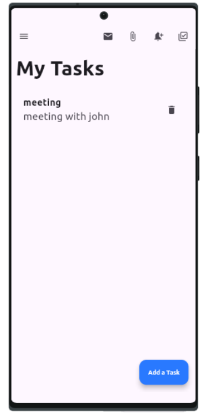
  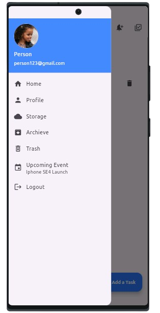
</p>

## How to Run

1. **Clone the repository:**
    ```bash
    git clone https://github.com/your-repo/task-manager-app.git
    ```
2. **Navigate to the project directory:**
    ```bash
    cd task-manager-app
    ```
3. **Install dependencies:**
    ```bash
    flutter pub get
    ```
4. **Run the app:**
    - For **iOS**: `flutter run -d ios`
    - For **Android**: `flutter run -d android`
    - For **Desktop**: `flutter run -d macos` (or your desktop platform)

## Dependencies
- **Flutter** (version 3.x or higher)
- **GetX** (state management)
- **device_preview** (for responsive design testing)

## Contact
For any issues or contributions, feel free to contact me at [fareless.ranger@gmail.com].
