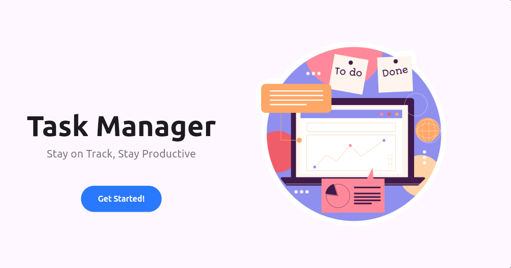

# Task Manager App

## Overview
This Task Manager App is designed to be both **responsive** and **adaptive**, offering an optimized experience across mobile platforms (iOS and Android) as well as desktop environments. The UI adjusts based on the screen size, ensuring smooth functionality for all device types.

### Features
- **Responsive Design**: Adapts to different screen sizes.
- **Adaptive UI**: Works seamlessly across mobile and desktop.
- **Cross-platform**: Supports Android, iOS, and Desktop.
- **GetX State Management**: For efficient and reactive state handling.
- **API Integration**: Fetches and displays data from APIs.

## Device Testing
The app has been thoroughly tested on various devices to ensure cross-platform compatibility and responsiveness.

### iOS Devices
- **iPhone SE (Smaller iPhone)**: Screenshots show the app on smaller iPhones.
- **iPhone 13 (Larger iPhone)**: Screenshots show the app on larger iPhones.

### Android Devices
- **Smaller Android Devices**: Tested on devices like Pixel 4, Moto G.
- **Larger Android Devices**: Tested on devices like Samsung Galaxy S21.

### Desktop
- **Desktop View**: The app layout adapts for larger screens like desktops, providing a tailored experience.

## Screenshots

### iPhone SE (Smaller iPhone) | iPhone 13 (Larger iPhone) | Smaller Android
<p float="left">
  
  
  
</p>

### iPhone SE | iPhone 13 | Larger Android
<p float="left">
  
  
  
</p>

### iPhone SE | iPhone 13 | Larger Android
<p float="left">
  
  
  
</p>

### Desktop Screenshots
<p float="left">
  
  
  
</p>

## How to Run

1. **Clone the repository:**
    ```bash
    git clone https://github.com/your-repo/task-manager-app.git
    ```
2. **Navigate to the project directory:**
    ```bash
    cd task-manager-app
    ```
3. **Install dependencies:**
    ```bash
    flutter pub get
    ```
4. **Run the app:**
    - For **iOS**: `flutter run -d ios`
    - For **Android**: `flutter run -d android`
    - For **Desktop**: `flutter run -d macos` (or your desktop platform)

## Dependencies
- **Flutter** (version 3.x or higher)
- **GetX** (state management)
- **http** (for API calls)
- **device_preview** (for responsive design testing)

## Contact
For any issues or contributions, feel free to contact me at [your-email@example.com].
